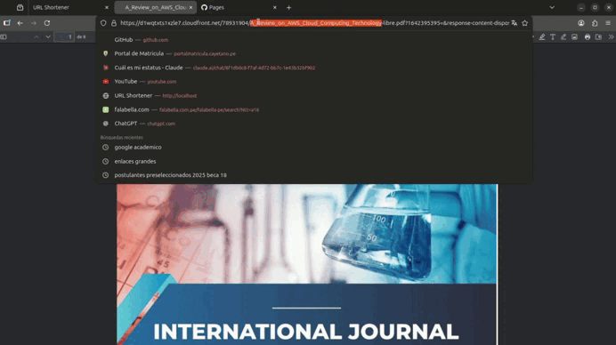

# 🔗 URL Shortener

<div align="center">

[](https://www.linkedin.com/in/andres-rodas-802309272)
[](https://github.com/AndresRJ18)
[](https://www.instagram.com/andresrodas.exe/)


*Full-stack URL shortener deployed on AWS ECS Fargate with automated CI/CD*

</div>

---

## 📽️ Demo



---

## ✨ Features

- 🔗 Shorten any URL and get an instant redirect link
- ⚡ Redis-backed storage with in-memory fallback
- 🖥️ Clean web frontend with comparison view
- 🔄 Fully automated CI/CD pipeline on every push to `main`
- ☁️ Serverless deployment on AWS ECS Fargate
- 📖 Auto-generated Swagger docs

---

## 🛠️ Tech Stack

| Layer | Technology |
|---|---|
| **API** | FastAPI (Python) |
| **Storage** | Redis (key-value + persistence) |
| **Proxy** | Nginx |
| **Containers** | Docker + Docker Compose |
| **IaC** | Terraform |
| **CI/CD** | GitHub Actions |
| **Registry** | AWS ECR |
| **Deployment** | AWS ECS Fargate |

---

## 🏗️ Architecture

**Local (Docker Compose)**
```
Client → Nginx :80 → FastAPI :8000 → Redis :6379
```

**Production (AWS)**
```
Client → ECS Fargate :8000 → FastAPI
              │
              └── Image from ECR (automated via CI/CD)
```

---

## 🚀 API Endpoints

| Method | Route | Description |
|---|---|---|
| `POST` | `/shorten` | Shorten a URL |
| `GET` | `/{code}` | Redirect to original URL |
| `GET` | `/health` | Service health check |
| `GET` | `/docs` | Swagger documentation |
| `GET` | `/` | Web frontend |

---

## 💻 Local Development

```bash
git clone https://github.com/AndresRJ18/url-shortener.git
cd url-shortener
docker compose up --build
```

Open [http://localhost](http://localhost) in your browser.

---

## ☁️ Deploy to AWS

```bash
cd terraform
terraform init
terraform apply
```

> ⚠️ Run `terraform destroy` when done to avoid unnecessary AWS charges.

---

## 🔄 CI/CD Pipeline

Every push to `main` automatically:

1. Builds the Docker image
2. Pushes to AWS ECR with `latest` tag + commit SHA

---

## 📁 Project Structure

```
url-shortener/
├── app/
│   ├── main.py              # FastAPI application
│   └── static/
│       └── index.html       # Web frontend
├── nginx/
│   └── nginx.conf           # Reverse proxy config
├── terraform/
│   └── main.tf              # AWS infrastructure
├── .github/workflows/
│   └── deploy.yml           # CI/CD pipeline
├── Dockerfile
├── docker-compose.yml
└── requirements.txt
```

---

<div align="center">

Made with ❤️ by [Andres Rodas](https://github.com/AndresRJ18)

</div>
